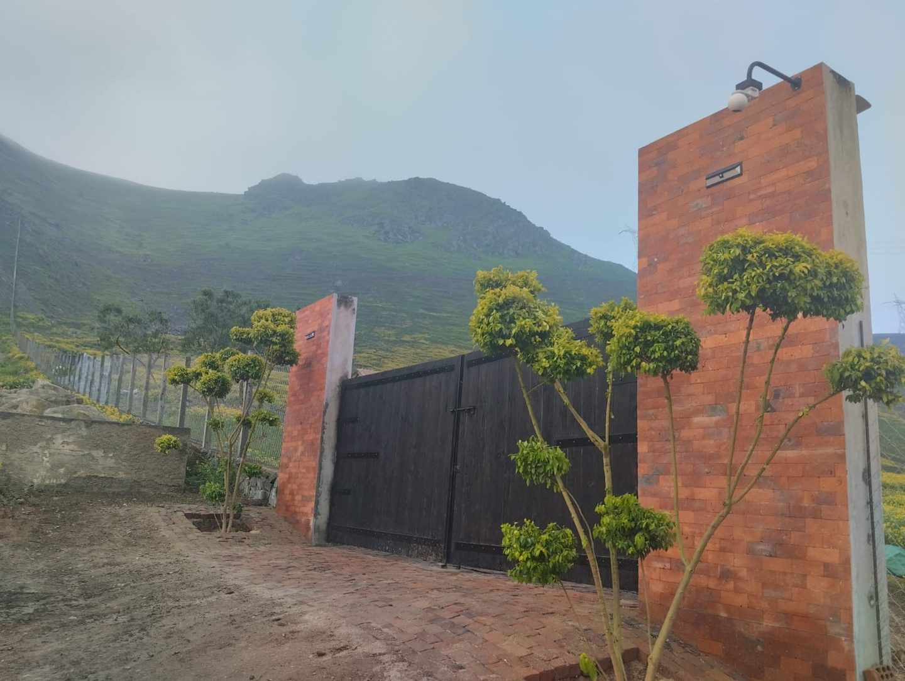
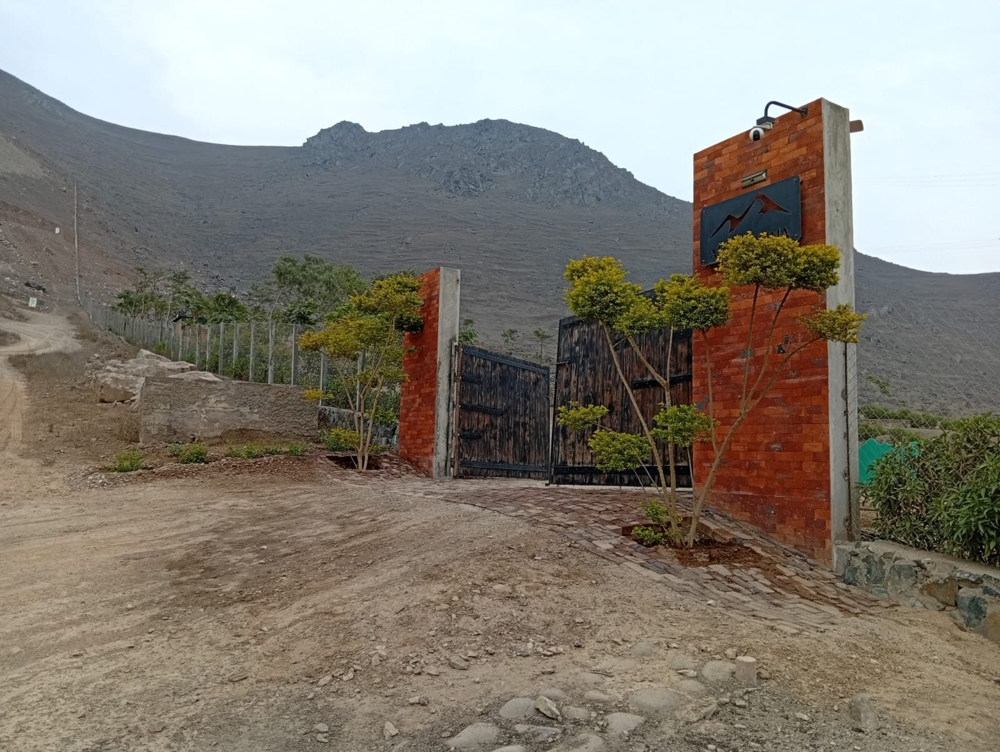

# PLAN DE REDISEÑO — ALTA COLINA
### Definitivo, ejecutable, ordenado por impacto · 2026-08-31

*Verifiqué todo lo que afirmo abajo contra los archivos reales: `index.html` (689 líneas), `assets/estilos.css` (1590), `assets/app.js` (587), `parcelas.json`, `medios.json`, `indexar-medios.py`, `tratar_color.py`, y **abrí las fotos**. Los contrastes están calculados por mí, no copiados de las auditorías. Donde una de las tres direcciones se equivocó, lo digo.*

---

# 1. LA DECISIÓN

## Se toma la dirección **B — DOS ESTACIONES**.

Dos de los tres lentes la eligieron (distintivo y realizable), y el tercero (vende) le reconoció "el mejor hallazgo comercial de los tres, y por lejos". Yo lo comprobé con mis propios ojos y es cierto:

- **`proyecto-portico-entrada.jpg` y `proyecto-portico-exterior.jpg` son el mismo pórtico**: mismo portón negro de tablones, misma cresta rocosa, mismo cerco de malla bajando por la izquierda, mismos arbustos podados en bola. En una el cerro está verde con neblina. En la otra está pelado y gris. El díptico existe, terminado, en el disco duro.
- **`proyecto-areas-verdes.jpg` es mejor de lo que decía B**: un óvalo de grass encendido **con la manguera negra de goteo cruzándolo de lado a lado**, con árboles plantados, bancas y un muro de gaviones — contra un cerro completamente muerto y una torre de alta tensión. Esa foto es la prueba visual de los 16,000 m² que el cliente pagó. Hoy está en `#lugar` con el pie "Áreas verdes sembradas y regadas" y nadie le pidió que probara nada.

Y el argumento de fondo, que es de venta y no de estética: **en temporada de lomas la inversión del cliente es invisible** — su verde se disuelve dentro del verde general del cerro. **Solo se ve cuando el cerro está muerto.** O sea: hoy el sitio está enterrando su mejor argumento por vergüenza del material, y `tratar_color.py` lo está tapando activamente.

## Lo que se le injerta

| De dónde | Qué | Por qué entra |
|---|---|---|
| **C — inventario** | **La tabla `MAPA / LISTA`**, con la lista como vista por defecto en celular | Medido: la parcela mediana da 42×47 px y la más angosta **18.8 px** con el SVG a 52rem, y **21.7 px** a 60rem. **Ningún ancho de SVG convierte eso en un objetivo de 44 px.** Una fila de lista sí lo es, siempre. La pieza firma hoy funciona peor justo en el aparato desde el que compra este señor |
| **C** | El piso sin JavaScript, la limpieza de `viewTransitionName`, el `--vw` medido | Tres piezas de construcción correctas que las otras dos no tienen |
| **C** | La fecha de corte, el contador `89 / 105` y la corrida calculada | Convierte "16 tomadas" de marketing en reporte. Con un candado propio, ver Paso 10 |
| **A — cartografía** | **La ficha calculada offline** desde la geometría que ya está en el JSON | Es la única forma que alguien encontró de hacer hablar a las 105 fichas **sin un solo dato nuevo del cliente**. Es la mejor idea de A y no depende de su disfraz de lámina |
| **A y C** | `?parcela=42` + "copiar enlace" | El mejor retorno por línea de todo el brief: convierte el sitio en herramienta de trabajo de Ronivel |

## La idea rectora, en una frase

> **El verde de la loma es prestado —la neblina lo trae y se lo lleva—. Lo único que no tiene temporada es lo que está inscrito y lo que está regado.**

Todo lo demás cuelga de ahí. La página recorre un año: entra en verde, se seca en la mitad, y en el punto exacto donde se seca aparece el argumento —la partida y los 16,000 m² con goteo— y vuelve a verdear al final. **La estructura del sitio ES el argumento de venta, no su decoración.** Por eso no es un collage: la tabla de C entra como la vista móvil del plano, y la ficha de A entra como el contenido de las filas de esa tabla. Ninguna de las dos trae su propio concepto — traen soluciones a huecos que B tiene.

## Tres correcciones que hago yo a la dirección B, y son bloqueantes

**1. El díptico NO puede decir "seis meses de diferencia".** Comparé las dos fotos: en la seca, el pilar derecho tiene **la placa negra con el logo de la montaña y una cámara instalada**. En la verde no hay ni placa ni cámara. **Son dos visitas con obra de por medio, no un antes/después de una temporada.** Si el copy afirma un intervalo, un comprador atento lo nota y el argumento de honestidad se voltea encima justo en la sección que existe para ser honesta. Copy correcto: **"El mismo pórtico, en dos visitas distintas."**

**2. Fuera los rangos de mes como etiqueta de foto.** `JUN — NOV` / `DIC — MAY` pegado a una foto es afirmar cuándo se tomó, y **las fotos no tienen EXIF** (WhatsApp lo borró). Se etiquetan por temporada (`TEMPORADA DE LOMAS` / `TEMPORADA SECA`) y los meses se dicen **solo en la glosa, describiendo el fenómeno** —que sí está documentado: las lomas costeras verdean con la garúa de junio a noviembre— nunca la foto.

**3. Fuera el sello del hero calculado con `new Date()`.** Lee el reloj del celular del visitante, no el cerro. Con el reloj mal puesto, la página **afirma un hecho falso sobre el terreno en su primera línea**. El reloj se usa solo para decidir qué pestaña viene marcada por defecto: si se equivoca, no se nota y no afirma nada.

---

# 2. QUÉ NO SE TOCA

Está funcionando. Que nadie lo "mejore" de paso:

| Qué | Por qué se queda |
|---|---|
| **El plano vivo SVG con las 105 parcelas clicables** | Es lo único que ningún portal ni ningún vecino puede copiar. Cambia de **rol** (pasa a ser el instrumento que demuestra la tesis) y de **ancho** (100vw), pero el mecanismo —polígonos, `data-estado`, ficha, roving tabindex— no se reescribe |
| **El código de color del letrero físico** | Rojo vendido / naranja separado / claro disponible. **Y NO se retempla el naranja a `#C77125`**, como proponen A y C: lo medí y sobre ese naranja **no existe ningún número legible** (pizarra 4.17, blanco 3.61 — los dos fallan). Con el `#D98032` de hoy, la pizarra da **5.08 y pasa**. A y C traen ese cambio en tándem con el arreglo del número y **juntos no funcionan** |
| **WhatsApp como única conversión, sin formularios largos** | `"No pedimos correo ni DNI. El mensaje se abre en su propio WhatsApp y lo envía usted."` es la mejor línea del sitio. Intocable. El flotante a 1 toque desde cualquier scroll también |
| **El formulario de 3 campos que arma el WhatsApp** | Funciona y no pide nada sensible |
| **Fraunces + Instrument Sans + IBM Plex Mono** | Las tres se quedan. Lo que cambia es que Fraunces **por fin se descargue completa** |
| **Cinzel en el logotipo** | A y C proponen borrarlo. **No.** Es la letra de la marca del cliente, subseteada a 11 caracteres (~2 KB). Cambiar el wordmark del cliente es decisión suya, no nuestra. Se le pregunta; no se hace por iniciativa propia |
| **El ritmo claro/oscuro/foto** | Ya está resuelto. Se reordena por lógica de argumento, y al reordenar **hay que mantener la alternancia** — la tabla del Paso 13 la deja verificada, con 6 valores de fondo en vez de 4 y ninguno repetido tres veces |
| **`animation-timeline: view()` con `@supports` + el respaldo IO de `app.js:537`** | Está bien hecho. Se aprovecha, no se reemplaza |
| **Espaciado en múltiplos de 4 px · `--radio: 2px` · tres niveles de sombra** | Se conservan. Lo único: **cumplir** el `--radio` en los 7 sitios que hoy tienen `border-radius: 999px` |
| **La paleta muestreada del terreno** | Entera. Se le **suman** tres tokens, los tres muestreados de las mismas fotos |
| **El píxel de Meta y los eventos `Contact` / `Lead` / `ViewContent`** | El andamiaje está bien montado. Falta el ID (Paso 16) |
| **`indexar-medios.py` y su curaduría a mano en `medios.json`** | Se le añade **un** campo. No se rehace |

---

# 3. EL PLAN, EN PASOS

## TANDA 0 — Los bugs que están publicados ahora mismo
*Medio día. Gane quien gane, esto va primero: son defectos, no diseño.*

### PASO 1 · El contraste del plano — la pieza firma tiene 9 números ilegibles
**Archivo:** `assets/estilos.css` (bloque 1548-1558 y `.parcela`, línea 545)
**Esfuerzo: bajo (10 min)**

```css
/* --- los números de estado. Medido por mí:
   blanco sobre #D98032 = 2.96 → falla 4.5 y falla hasta 3:1.
   Son 9 de las 105 parcelas, en la pieza firma del sitio. --- */
.parcela__num[data-estado="vendida"]   { fill: #FFFFFF; }          /* 5.44 sobre #C0392B */
.parcela__num[data-estado="reservada"] { fill: var(--pizarra); }   /* 5.08 sobre #D98032 */
```

```css
/* --- las parcelas libres eran invisibles: #C9D6DB sobre terreno #E4EBE0 = 1.22.
   Las que quieres vender no se distinguían del suelo.
   El relleno solo NUNCA llega a 3:1 contra un terreno de valor medio
   (lo medí: 1.57 y 1.50). Quien carga el borde es el trazo. --- */
.parcela {
  fill: var(--garua-luz);              /* #EDF1F2 — la parcela no cambia con la temporada */
  stroke: var(--seca);                 /* #6A5F50 — 3.49 sobre terreno verde, 3.65 sobre seco */
  stroke-width: 1.5;
  cursor: pointer;
  transition: fill .18s ease, stroke .18s ease;
}
.parcela__num { fill: var(--pizarra); }        /* 13.24 sobre la parcela libre */
```

**Resuelve:** los dos fallos de contraste que las tres auditorías encontraron, sin el retemplado de naranja que las rompía.

---

### PASO 2 · Fraunces no se está descargando entera — media dirección de arte es letra muerta
**Archivos:** `index.html:29` · `assets/estilos.css` (líneas 72, 83, 137, 326, 951, 1348, 1376, 1474, 1512)
**Esfuerzo: bajo (20 min)**

La URL pide `Fraunces:opsz,wght@9..144,300..600`. Las **8** declaraciones de `font-variation-settings` del CSS piden `SOFT` y `WONK`, que **no vienen en el archivo**. `WONK 1` —la `g` de una panza, la `y` de cola recta, las terminales quebradas— es literalmente lo que hace que Fraunces no parezca Playfair, y **nunca se ha renderizado en este sitio**. Y el rango `300..600` que sí se paga no lo usa nadie: revisé los 11 `font-weight` del archivo y **Fraunces se usa siempre en peso 400**.

```html
<!-- index.html:29 — se cambia rango de peso que nadie usa por ejes que sí significan.
     Sin ital: las tres cursivas del sitio son textos que se van igual (ver Paso 15). -->
<link rel="stylesheet" href="https://fonts.googleapis.com/css2?family=Fraunces:opsz,wght,SOFT,WONK@9..144,400,0..100,0..1&family=Instrument+Sans:wght@400;500;600&family=IBM+Plex+Mono:wght@400;500&display=swap">
```

```css
body { font-synthesis-weight: none; font-synthesis-style: none; }  /* si algo falla, romana honesta */

/* `font-optical-sizing` no aparece ni una vez en 1590 líneas. Su valor por defecto
   (auto) haría lo correcto solo, y las 8 declaraciones lo anulan clavando un opsz
   fijo que no sigue al clamp(): .titulo-seccion clava opsz 110 y en 360px renderiza
   a 32px. Fraunces dibujada para 110pt vista a 32px en un gama media se ve hilachenta,
   y así están nueve de los once titulares. */
h1, h2, h3 {
  font-optical-sizing: auto;
  font-variation-settings: "SOFT" 20, "WONK" 1;   /* sin opsz: que lo siga solo */
}
```
Borrar `"opsz" NNN` de las 8 declaraciones. Mantener SOFT/WONK, que ahora sí llegan.

**Comprobación de 10 segundos:** poner `font-variation-settings: "WONK" 0` en `.portada__titular` y recargar. Si el titular no cambia ni un píxel, el eje no está llegando y el paso no se hizo.

---

### PASO 3 · Los seis defectos sueltos
**Archivos:** `index.html`, `assets/estilos.css`, `assets/app.js`
**Esfuerzo: bajo (40 min)**

```html
<!-- index.html:215 — decía "77 parcelas". Un usuario de lector de pantalla recibe
     un dato falso en la página que se vende por comprobable. Son 105.
     El comentario de app.js:217 dice lo mismo: corregirlo también. -->
aria-label="Plano del condominio: 105 parcelas. Use las flechas para recorrerlas y Enter para abrir una."
```

```css
/* no existe en las 1590 líneas, y la cabecera fija de ~70px tapa el titular
   en los cuatro enlaces del nav */
main > section { scroll-margin-top: 5rem; }

/* el momento diseñado para ser el grito llegaba en voz más baja que un párrafo:
   a 375px la banda daba 28.75px y los h2 32px */
.banda__frase { font-size: clamp(2.75rem, 1rem + 3.4vw, 4rem); }
```

```js
// app.js — abrir(): hoy hace `if (p.estado === "vendida") return;`
// Con enlaces compartibles (Paso 9), una vendida mandada por error no abre NADA.
if (!p) return;
// ...y más abajo, la ficha de una vendida ofrece las vecinas libres:
if (p.estado === "vendida" || p.estado === "reservada") {
  const vecinas = datos.parcelas
    .filter((x) => x.estado === "disponible" && Math.abs(x.num - p.num) <= 3)
    .slice(0, 3).map((x) => x.num);
  if (vecinas.length) filas.push(`Libres al lado: ${vecinas.join(" · ")}`);
}
```

**Fuera `.cifras`** (`index.html:174-189` + `estilos.css:1358-1400`): repite tres de los cinco números de la cinta a 1,7 pantallas de distancia, y su `.cifra__n` se imprime a **56 px** contra un h1 de **49.6 px** en celular. Lo más grande de la página en el aparato desde el que compra este señor era un número ya dicho.

**El Libro de Reclamaciones** (`index.html:643`) sale de producción hasta tener el enlace real. En una web cuyo único argumento es la formalidad, un botón de formalidad que no lleva a ningún lado es peor que no tenerlo. **Es un pendiente bloqueante del cliente**, no un arreglo de código (Paso 16).

---

## TANDA 1 — LA IDEA RECTORA

### PASO 4 · El díptico — `#temporadas` reemplaza la banda `#loma` ★
**Archivos:** `index.html` (sustituye 155-168) · `assets/estilos.css`
**Esfuerzo: medio (2 h)**

```html
<section class="temporadas" id="temporadas" aria-labelledby="temporadas-frase">
  <div class="temporadas__par">
    <figure class="temporada">
      
      <figcaption>
        <span class="temporada__nombre">Temporada de lomas</span>
        <span class="temporada__glosa">La neblina se condensa y cubre la ladera de vegetación.</span>
      </figcaption>
    </figure>
    <figure class="temporada">
      
      <figcaption>
        <span class="temporada__nombre">Temporada seca</span>
        <span class="temporada__glosa">Sin neblina, el cerro toma el color de la tierra.</span>
      </figcaption>
    </figure>
  </div>

  <div class="temporadas__nota envoltura">
    <p class="banda__rotulo">El mismo pórtico</p>
    <p class="banda__frase" id="temporadas-frase">
      El mismo pórtico,<br>en dos visitas distintas.
    </p>
    <p class="temporadas__cuerpo">
      Entre junio y noviembre la neblina de la costa se condensa sobre estas laderas
      y las cubre de vegetación: es el mismo fenómeno que forma las Lomas de Lúcumo,
      aquí al lado. El resto del año el cerro se seca y toma el color de la tierra.
      Ninguna de las dos fotos está retocada. En esta página va a ver las dos
      temporadas, porque así se ve el terreno todo el año y no solo en su mejor mes.
    </p>
  </div>
</section>
```

```css
.temporadas { background: var(--pizarra); color: var(--garua-luz); }

.temporadas__par {
  display: grid;
  grid-template-columns: 1fr;        /* apiladas en celular */
  gap: 2px;
  background: var(--seca);           /* el corte duro entre las dos, sin fundido */
}
@media (min-width: 46rem) { .temporadas__par { grid-template-columns: 1fr 1fr; } }

.temporada { position: relative; margin: 0; }
.temporada img {
  inline-size: 100%;
  block-size: clamp(15rem, 40vw, 28rem);
  object-fit: cover;
  object-position: 50% 40%;          /* el pórtico y la cresta, no el suelo */
}
.temporada figcaption {
  position: absolute; inset-block-end: 0; inset-inline: 0;
  display: grid; gap: .25rem;
  padding: 3.5rem 1.25rem 1.25rem;
  background: linear-gradient(to top,
    color-mix(in srgb, var(--pizarra) 90%, transparent), transparent);
}
.temporada__nombre {
  font-family: var(--dato); font-size: var(--t-rotulo);
  letter-spacing: .16em; text-transform: uppercase; color: var(--garua-luz);
}
.temporada__glosa {
  font-size: var(--t-s);
  color: color-mix(in srgb, var(--garua-luz) 80%, transparent);
}

.temporadas__nota { padding-block: clamp(2.5rem, 6vw, 4rem); display: grid; gap: 1.25rem; }
.temporadas__cuerpo {
  max-inline-size: var(--lectura);
  color: color-mix(in srgb, var(--garua-luz) 82%, transparent);
}

/* NO lleva .revela y NO tiene una sola transición. Deliberado:
   después de varias pantallas con movimiento, la quietud absoluta es
   lo que hace que esto se lea como evidencia y no como presentación. */
```

**Por qué funciona justo porque los encuadres NO coinciden:** si estuvieran perfectamente alineadas parecería un render. Que sean dos visitas distintas, con dos encuadres distintos y con la placa del logo instalada en una y no en la otra, es lo que las vuelve creíbles. Es un documento de campo, no una comparación de laboratorio. **Por eso el comparador arrastrable queda descartado y no por falta de habilidad** (ver §5).

**Peso:** `portico-entrada.jpg` (253 KB) ya se descarga en la portada — el navegador la reusa del caché. Solo entra `portico-exterior.jpg` (348 KB), `lazy` y bajo el pliegue.

**Resuelve:** el pasivo del material árido; el argumento duplicado entre `#lugar` y la banda `#loma`; y la banda que en celular hablaba más bajo que un párrafo.

---

### PASO 5 · El interruptor de estación sobre el plano a 100vw ★★
**Archivos:** `index.html` (`#plano`) · `assets/estilos.css` · `assets/app.js`
**Esfuerzo: medio (3 h)** — el detalle completo está en §4.

```html
<fieldset class="estacion" id="estacion">
  <legend class="visualmente-oculto">Cómo se ve el terreno según la temporada</legend>
  <label class="estacion__op">
    <input type="radio" name="estacion" value="lomas" checked>
    <span class="estacion__nom">Temporada de lomas</span>
  </label>
  <label class="estacion__op">
    <input type="radio" name="estacion" value="seca">
    <span class="estacion__nom">Temporada seca</span>
  </label>
</fieldset>
<p class="estacion__glosa" id="estacion-glosa" role="status" aria-live="polite"></p>
```

```css
/* el plano rompe el contenedor. .plano ya tiene overflow:hidden (css:498),
   así que romper el marco es gratis. Se usa --vw medido, no 100vw:
   100vw incluye la barra de scroll y por eso el sangrado del carrusel
   sale hoy a 33px de un lado y 48 del otro. */
.sangra {
  inline-size: var(--vw);
  margin-inline: calc(50% - var(--vw) / 2);
  padding-inline: max(var(--margen), calc(var(--vw) / 2 - var(--ancho) / 2));
}
.plano__lienzo { composes: sangra; }   /* o aplicar la clase .sangra en el HTML */

.estacion {
  display: grid; grid-template-columns: 1fr 1fr; gap: 2px;
  margin: 0 0 1rem; padding: 0; border: 0; max-inline-size: 34rem;
}
.estacion__op {
  position: relative; display: grid; place-items: center;
  min-block-size: 3rem; padding: .75rem 1rem; cursor: pointer;
  border: 1px solid color-mix(in srgb, var(--garua-luz) 22%, transparent);
}
.estacion__op input { position: absolute; inset: 0; margin: 0; opacity: 0; cursor: pointer; }
.estacion__nom {
  font-family: var(--dato); font-size: var(--t-rotulo);
  letter-spacing: .14em; text-transform: uppercase;
  color: color-mix(in srgb, var(--garua-luz) 68%, transparent);
}
.estacion__op:has(input:checked) {
  background: color-mix(in srgb, var(--garua-luz) 12%, transparent);
  border-color: var(--garua-luz);
}
.estacion__op:has(input:checked) .estacion__nom { color: var(--garua-luz); }
.estacion__op:has(input:focus-visible) { outline: 2px solid var(--bosque); outline-offset: 2px; }
.estacion__glosa {
  font-size: var(--t-m); max-inline-size: 46ch; min-block-size: 3.4em;
  margin-block-end: 2rem;
  color: color-mix(in srgb, var(--garua-luz) 84%, transparent);
}

/* --- el plano cambia de temporada --- */
.plano__svg                        { --terreno: #B9C79F; --terreno-trazo: #A3B389; --camino: var(--ladrillo); }
.plano__svg[data-estacion="seca"]  { --terreno: #CFC5B4; --terreno-trazo: #B9AE96; --camino: #B08F7C; }

.plano__terreno { fill: var(--terreno); stroke: var(--terreno-trazo); stroke-width: 2; }
.plano__camino  { fill: var(--camino); opacity: .9; }
.plano__verde   { fill: var(--regado); opacity: 1; }   /* NO cambia: ese es el punto */

@media (prefers-reduced-motion: no-preference) {
  .plano__terreno, .plano__camino { transition: fill .9s cubic-bezier(.4,0,.2,1), stroke .9s; }
}
```

```js
/* app.js — se llama al final de dibujarPlano() */
function armarEstacion() {
  const svg   = $("#plano-svg");
  const caja  = $("#estacion");
  const glosa = $("#estacion-glosa");
  if (!svg || !caja) return;

  const TXT = {
    lomas: "El cerro verdea con la neblina, entre junio y noviembre. Las áreas verdes del condominio están regadas los doce meses del año.",
    seca:  "El resto del año el cerro se seca. Lo verde que queda son los 16,000 m² que el condominio plantó y riega por goteo.",
  };
  const poner = (v) => { svg.dataset.estacion = v; glosa.textContent = TXT[v] || ""; };

  // arranca en la temporada probable del mes en que se abre la página.
  // Si el reloj del visitante está mal, no se afirma nada: solo cambia
  // qué pestaña viene marcada. NUNCA se imprime el mes como dato.
  const m = new Date().getMonth();
  poner((m >= 5 && m <= 10) ? "lomas" : "seca");
  const r = caja.querySelector(`input[value="${svg.dataset.estacion}"]`);
  if (r) r.checked = true;

  caja.addEventListener("change", (e) => {
    if (e.target.name !== "estacion") return;
    poner(e.target.value);
    // es la única métrica del sitio que mide COMPRENSIÓN y no solo intención
    medir("ViewContent", { content_type: "temporada", content_ids: [e.target.value] });
  });
}
```

```js
/* el --vw medido: arregla el sangrado asimétrico del carrusel Y habilita el plano
   a ancho completo con la misma línea */
const medirVW = () => document.documentElement.style
  .setProperty("--vw", document.documentElement.clientWidth + "px");
addEventListener("resize", medirVW, { passive: true });
medirVW();
```

**Resuelve:** la pieza firma enjaulada en 1216 px (el mismo ancho que un párrafo); el hueco de valor de la paleta; y le da a la página el único gesto que ningún competidor puede copiar.

---

## TANDA 2 — EL PLANO EN EL CELULAR

### PASO 6 · `MAPA / LISTA` — la vista que el aparato del comprador sí puede tocar
**Archivos:** `index.html` (`#plano`) · `assets/estilos.css` · `assets/app.js`
**Esfuerzo: medio-alto (5 h)** — es el build más grande del plan y cae sobre la pieza que no puede fallar. Probarlo en un gama media de verdad, no en el escritorio.

```html
<div class="plano__vistas" role="tablist" aria-label="Cómo ver las parcelas">
  <button class="plano__vista" type="button" role="tab" id="tab-lista"
          aria-controls="vista-lista" aria-selected="true">Lista</button>
  <button class="plano__vista" type="button" role="tab" id="tab-mapa"
          aria-controls="vista-mapa" aria-selected="false">Mapa</button>
</div>

<div id="vista-lista" role="tabpanel" aria-labelledby="tab-lista">
  <table class="registro">
    <caption class="visualmente-oculto">Estado de las 105 parcelas del condominio</caption>
    <thead>
      <tr>
        <th scope="col">N.º</th><th scope="col">Fila</th><th scope="col">Estado</th>
        <th scope="col"><span class="visualmente-oculto">Acción</span></th>
      </tr>
    </thead>
    <!-- piso sin JavaScript: el registro NUNCA se muestra en blanco -->
    <tbody id="registro-cuerpo">
      <tr><td colspan="4">Confirmamos la disponibilidad al momento por WhatsApp: 907 155 138.</td></tr>
    </tbody>
  </table>
</div>
```

```js
function dibujarRegistro(datos) {
  const cuerpo = $("#registro-cuerpo");
  if (!cuerpo) return;
  // Las bandas reales de parcelas.json son 23 valores (A, B-inf, B-sup, C-inf,
  // C-sup, D-inf, D-sup, E, F y catorce sueltas de G a T), NO seis como decía
  // la dirección A. Se agrupa por la letra, y lo que no cae en A-F es "Borde".
  const FILA = (b) => /^[A-F]/.test(b) ? `Fila ${b[0]}` : "Borde";

  cuerpo.innerHTML = datos.parcelas.map((p) => `
    <tr data-num="${p.num}" data-estado="${p.estado}">
      <th scope="row" class="registro__n">${String(p.num).padStart(3, "0")}</th>
      <td class="registro__fila">${FILA(p.banda)}</td>
      <td class="registro__estado"><span>${ESTADOS[p.estado]}</span></td>
      <td class="registro__accion">${
        p.estado === "disponible"
          ? `<button class="registro__preguntar" type="button" data-num="${p.num}">Preguntar</button>`
          : ""}</td>
    </tr>`).join("");

  // vínculo de dos vías: la fila abre la misma ficha que el polígono
  cuerpo.addEventListener("click", (e) => {
    const tr = e.target.closest("tr[data-num]");
    if (!tr) return;
    const poly = $(`#plano-svg .parcela[data-num="${tr.dataset.num}"]`);
    if (poly) window.__abrirFicha(poly);
  });
}
```

```css
.registro { inline-size: 100%; border-collapse: collapse; font-family: var(--dato); }
.registro th, .registro td {
  text-align: start; padding: .875rem .75rem;   /* fila de 48px: pasa el mínimo de 44 */
  border-block-end: 1px solid color-mix(in srgb, var(--garua-luz) 14%, transparent);
  font-size: var(--t-s); font-weight: 400;
  font-variant-numeric: tabular-nums lining-nums;
}
.registro thead th {
  font-size: var(--t-rotulo); letter-spacing: .14em; text-transform: uppercase;
  color: color-mix(in srgb, var(--garua-luz) 62%, transparent);
}
/* lo que se vende es el campo claro; lo tomado baja de peso */
.registro tr[data-estado="disponible"] { color: var(--garua-luz); }
.registro tr:not([data-estado="disponible"]) {
  color: color-mix(in srgb, var(--garua-luz) 55%, transparent);
}
/* el tachado es DECORACIÓN: la palabra "Vendida" está escrita en la celda.
   Nunca portar el significado solo con presentación. */
.registro tr:not([data-estado="disponible"]) .registro__estado span { position: relative; }
.registro tr:not([data-estado="disponible"]) .registro__estado span::after {
  content: ""; position: absolute; inset-inline: -.15em; inset-block-start: 50%;
  block-size: 1px; background: currentColor;
}
.registro__preguntar {
  min-block-size: 2.75rem; padding: 0 1rem;
  background: none; color: inherit; cursor: pointer;
  border: 1px solid color-mix(in srgb, var(--garua-luz) 34%, transparent);
  border-radius: var(--radio);
  font: 500 var(--t-rotulo)/1 var(--cuerpo);
  letter-spacing: .12em; text-transform: uppercase;
}

/* la lista NO lleva scroller interno: 105 filas dentro de un overflow-y en un
   gama media es el patrón más confiablemente trabado que existe. Crece en el
   flujo normal y se acorta con los chips. */
```

**Los tres chips de filtro** (CSS puro, ocho líneas de JS):
```css
.capa-parcelas[data-filtro="libres"]  .parcela:not([data-estado="disponible"]) { opacity: .12 }
.capa-parcelas[data-filtro="tomadas"] .parcela[data-estado="disponible"]       { opacity: .12 }
#registro-cuerpo[data-filtro="libres"]  tr:not([data-estado="disponible"]) { display: none }
#registro-cuerpo[data-filtro="tomadas"] tr[data-estado="disponible"]       { display: none }
```

Vista por defecto: `lista` bajo 62rem, `mapa` arriba. **Resuelve:** el punto débil real del sitio —la pieza firma funcionando peor justo donde compra este señor— y de paso da mejor accesibilidad que el SVG, porque un `<table>` con `<caption>` y `scope` lo anuncia solo el lector de pantalla.

---

## TANDA 3 — LA ESTRUCTURA Y EL ARGUMENTO

### PASO 7 · La partida sube al puesto 2 y aprende a decir cómo se comprueba
**Archivo:** `index.html` (mover 301-340 arriba, después de la portada) · `assets/estilos.css:437`
**Esfuerzo: bajo-medio (2 h)**

Hoy el h1 promete "partida registral propia" en la pantalla 1 y la prueba aparece en la **pantalla 7,4** de 17,6. El escéptico con datos móviles no llega. Y el documento —el objeto que mata el miedo #1— mide **536 px contra los 616 px de su propio texto**: está al revés.

```css
.partida__cuerpo { grid-template-columns: minmax(0, 1fr) minmax(0, 1.4fr); }
.partida {
  margin-block-end: -4rem;      /* el único objeto de la página que se sale del marco
                                   es el que vence el miedo */
  position: relative; z-index: 2;
}
```

Copy nuevo, dentro de la sección (reemplaza el párrafo de `index.html:311-315`):

```html
<h3 class="comprobar__titulo">Cómo lo comprueba usted, sin pedirnos permiso</h3>
<ol class="comprobar">
  <li><span class="comprobar__n">1</span>
      Pídanos el número de partida por WhatsApp. Se lo mandamos escrito.</li>
  <li><span class="comprobar__n">2</span>
      Con ese número entre a sunarp.gob.pe y pida la copia literal, o pídala en
      ventanilla en cualquier oficina registral.</li>
  <li><span class="comprobar__n">3</span>
      Ahí va a leer el área de la parcela, sus linderos y a nombre de quién está
      inscrita. Si algo no coincide con lo que le dijimos, no compre.</li>
</ol>
```
> **Antes de publicar:** verificar en sunarp.gob.pe el nombre exacto del servicio y si sigue habiendo trámite en línea. **No se publica el paso 2 sin comprobarlo.**

Y la definición que el sitio nunca da, con la palabra que él teme:
```html
<p>
  Independizar es partir el terreno matriz y abrirle a cada parcela su propia
  partida en el Registro de Predios: su número, su área y su historia aparte.
  Por eso aquí usted no compra <strong>«acciones y derechos»</strong> de un terreno
  de todos: compra un predio suyo, con su partida. Y eso también importa el día que
  quiera venderla: una parcela con partida propia se vuelve a vender sola.
</p>
```
Ese último párrafo es **lo único de toda la página que le habla al comprador inversionista**, que es la mitad del público y hasta hoy solo existe como una opción de un `<select>`.

**Resuelve:** la prueba pasa de la pantalla 7,4 a la 2; el documento deja de ser el objeto más chico de la mitad inferior; y el sitio dice algo que ningún competidor dice porque a nadie le conviene.

---

### PASO 8 · `#regado` — la sección que prueba los 16,000 m²
**Archivos:** `index.html` (reemplaza `#lugar` 113-149 y absorbe 3 de los 6 puntos de `#obra`) · `assets/estilos.css:1402-1470`
**Esfuerzo: medio (3 h)**

Fondo `--seca`. La foto es `proyecto-areas-verdes.jpg` **grande**, no de adorno. Titular: **16,000 m²**. Y la nota **por fin se monta sobre la foto** — el comentario del CSS (línea 1404) lo promete textualmente desde el primer día y la grilla hace exactamente lo contrario (`grid-template-areas: "texto figura" / "nota figura"` le da su propia celda: cero solape).

```css
@media (min-width: 62rem) {
  .regado__reja {
    grid-template-columns: minmax(0, 24rem) minmax(0, 1fr);
    grid-template-areas: "texto figura" "texto figura";
    column-gap: clamp(2rem, 5vw, 4rem);
  }
  .regado__texto  { grid-area: texto; }
  .regado__figura { grid-area: figura; }
  .regado__nota {
    grid-area: figura;
    align-self: end; justify-self: start;
    max-inline-size: 22rem;
    margin: 0 0 -2.5rem -3rem;      /* AHORA sí se monta sobre la foto */
    position: relative; z-index: 1;
  }
}
/* la medida de línea entre 768 y 992px hoy llega a ~105 caracteres:
   .regado__texto solo recibe su tope dentro del media query */
.regado__texto { max-inline-size: var(--lectura); }
```

Copy:
```
LO QUE ESTÁ REGADO

16,000 m²

Alta Colina no está esperando la lluvia. Los 16,000 m² de áreas verdes están
sembrados y tienen riego por goteo instalado: en esta foto se ve la manguera
cruzando el grass, y el cerro de atrás es el mismo cerro, en la misma foto,
en temporada seca.

  02 · Cerco perimetral y pórtico — el condominio está cerrado y su ingreso
       está construido en ladrillo cara vista.
  05 · Cerco vivo y riego por goteo — vegetación plantada con la línea de goteo
       ya puesta, para que crezca sin desperdiciar agua.
  06 · Biodigestores instalados — tratamiento de aguas residuales ya puesto.

NOTA MONTADA SOBRE LA FOTO:
  De diciembre a mayo el cerro se seca y toma el color de la tierra.
  Esto no.
```

Los otros tres puntos de `#obra` se van porque ya están dichos: el 01 es **casi palabra por palabra** la `.partida__glosa`, el 03 lo *muestra* el plano, y el 04 es el 16,000 m² que ahora es el titular de esta sección.

**Resuelve:** el peor texto del sitio ("un entorno que equilibra la proyección residencial de la capital con la esencia natural de la costa peruana"); la duplicación de `#obra`; y convierte la foto que más nos avergonzaba en la prueba de la inversión más cara del cliente.

---

### PASO 9 · `?parcela=42` — el sitio se vuelve herramienta de trabajo de Ronivel
**Archivo:** `assets/app.js`
**Esfuerzo: bajo (1 h)** — el mejor retorno por línea de todo el plan.

```js
/* al final de dibujarPlano(), después de armarFicha() */
const n = Number(new URLSearchParams(location.search).get("parcela"));
if (n) {
  const poly = $(`#plano-svg .parcela[data-num="${n}"]`);
  if (poly) {
    window.__abrirFicha(poly);
    poly.scrollIntoView({ block: "center", inline: "center" });
    $(`#registro-cuerpo tr[data-num="${n}"]`)?.scrollIntoView({ block: "center" });
  }
}
```
Más un botón en la ficha:
```js
copiar.addEventListener("click", async () => {
  const url = `${location.origin}${location.pathname}?parcela=${p.num}`;
  try { await navigator.clipboard.writeText(url); copiar.textContent = "Enlace copiado"; }
  catch { prompt("Copie este enlace:", url); }   // http, iframes y navegadores viejos
});
```

Ronivel manda `alta-colina.com/?parcela=42` por WhatsApp y el prospecto abre el plano **con su parcela encendida y la ficha abierta**. Habilita un QR en el letrero físico del terreno. Y como el píxel ya mide `ViewContent` por parcela, la campaña puede optimizar por parcela concreta. **Un aviso de Adondevivir siempre nos va a ganar en precio y m² —los dos datos que no tenemos—. Esto es la cancha donde el portal no juega.**

**Requiere el Paso 3** (que `abrir()` no retorne en seco con las vendidas), o una vendida compartida por error no abre nada.

---

### PASO 10 · El contador, la corrida y la fecha que se vence sola
**Archivos:** `parcelas.json` (un campo) · `assets/app.js` (`escribirNota`)
**Esfuerzo: bajo (1,5 h)**

Verifiqué los datos: **F = 8 de 8 tomada, E = 4 de 8 (las 9-12), D-inf = 3 (24, 25, 26), D-sup = 1 (la 36)**. Las tomadas 1 a 12 son **consecutivas, sin huecos**. Eso no hay que afirmarlo: el plano lo demuestra solo, y la barra de 105 tics lo comprime a una sola línea.

```js
function escribirNota(datos) {
  const nota  = $("#plano-nota");
  const total = datos.parcelas.length;
  const tomadas = datos.parcelas.filter((p) => p.estado !== "disponible");
  const libres  = total - tomadas.length;

  // la corrida se CALCULA, así que sigue siendo cierta el día que se venda la 42
  const nums = tomadas.map((p) => p.num).sort((a, b) => a - b);
  let ini = nums[0], fin = nums[0], mejor = [ini, fin];
  for (let i = 1; i < nums.length; i++) {
    if (nums[i] === fin + 1) fin = nums[i];
    else { if (fin - ini > mejor[1] - mejor[0]) mejor = [ini, fin]; ini = fin = nums[i]; }
  }
  if (fin - ini > mejor[1] - mejor[0]) mejor = [ini, fin];

  // --- el candado contra el registro vencido ---
  // Si nadie actualiza la fecha, la fecha DESAPARECE sola en vez de convertirse
  // en mentira. Un registro vencido destruye exactamente la confianza que vino
  // a construir; es preferible perder el dato que perder el argumento.
  const corte = datos.corte ? new Date(datos.corte + "T12:00:00") : null;
  const dias  = corte ? (Date.now() - corte) / 86400000 : Infinity;
  const fecha = dias < 120
    ? ` Estado al ${corte.toLocaleDateString("es-PE", { day: "numeric", month: "long", year: "numeric" })}.`
    : "";

  $("#plano-contador").textContent = libres;
  $("#plano-contador-pie").textContent = `de ${total} disponibles`;
  nota.textContent =
    `${tomadas.length} de las ${total} parcelas ya están tomadas: ` +
    `${datos.vendidas} vendidas y ${datos.separadas} separadas.` + fecha +
    ` Las parcelas ${mejor[0]} a la ${mejor[1]} están tomadas de corrido: ` +
    `es toda la fila de abajo del plano y la mitad de la siguiente.` +
    ` La disponibilidad cambia: confírmela al escribirnos.`;
}
```
En `parcelas.json`, un campo: `"corte": "2026-08-30"` — confirmar con el cliente que sigue vigente antes de estampar la fecha.

**La barra de 105 tics** (105 `<span>`, cero datos nuevos):
```css
.barra { display: grid; grid-auto-flow: column; grid-auto-columns: 1fr; gap: 1px; block-size: 1.5rem; }
.barra span[data-estado="disponible"] { background: color-mix(in srgb, var(--garua-luz) 30%, transparent); }
.barra span[data-estado="reservada"]  { background: #D98032; }
.barra span[data-estado="vendida"]    { background: #C0392B; }
```
Se ve un **bloque macizo pegado al extremo izquierdo** y después una corrida pálida larguísima. De un vistazo, sin leer una palabra, ya se entendió el argumento.

**Ojo con el punto cardinal:** digo "la fila de abajo del plano", nunca "el frente sur". **El norte del plano no está confirmado en ningún archivo.** La dirección A escribió "el frente sur ya está tomado completo" como frase de venta — es una invención, y en el sitio que se vende por no exagerar no entra.

---

### PASO 11 · La ficha calculada — 105 callejones sin salida se vuelven 105 argumentos
**Archivos nuevo:** `describir-parcelas.py` · **modifica:** `parcelas.json`, `assets/app.js:180`
**Esfuerzo: medio (2 h)**

Hoy la ficha de cada parcela dice `"Consulte medidas y precio"` — que es exactamente lo único que no podemos responder. Con **cero datos nuevos del cliente**, la geometría que ya está en `parcelas.json` da tres hechos por parcela: su fila, si da al camino y si colinda con un área verde.

```python
# describir-parcelas.py — se corre una vez, offline. numpy ya está instalado.
# Muestrea los paths de geometria.camino y geometria.verdes (solo M/C/Z: un
# aplanador de bézier cúbica de ~30 líneas) y mide la distancia mínima de los
# vértices de cada parcela a esas nubes de puntos. Escribe p["descripcion"].
#
#   -> "Fila D · da al camino · colinda con un área verde"
#
# NO inventa: solo escribe lo que la geometría sostiene. Nada de metrajes,
# nada de orientación, nada de puntos cardinales.
```

```js
/* app.js — abrir() */
const filas = [];
if (p.descripcion) filas.push(p.descripcion);
filas.push(p.m2 ? `Área <b>${p.m2} m²</b>` : `Área <b>se mide en la visita</b>`);
filas.push("Independizada en SUNARP · partida propia");
```

`"se mide en la visita"` va **solo dentro de la ficha abierta**, nunca dibujado 105 veces sobre el plano como cotas vacías: para un escéptico, 105 repeticiones de "no sabemos" es lo contrario del rigor que A buscaba.

**Y el día que lleguen los m²:** entran en `p.m2` y la ficha los muestra. Cero rediseño.

---

## TANDA 4 — TIPOGRAFÍA, COLOR Y PODA

### PASO 12 · La escala: dos registros, no siete tallas · y SOFT con significado
**Archivo:** `assets/estilos.css:29-37`
**Esfuerzo: bajo (1,5 h)**

El comentario de la línea 29 dice "potencias de 1.5". Las razones reales van de 1.17 a 2.03. Y en 360 px `--t-xl` queda a 1.23× de `--t-l`: a un brazo de distancia, en un celular, son el mismo tamaño.

```css
--t-rotulo: 0.6875rem;                                /* 11px · un solo tamaño de etiqueta */
--t-xs:     var(--t-rotulo);                          /* alias: migra los 25 usos gratis   */
--t-s:      0.875rem;
--t-base:   1.0625rem;
--t-m:      clamp(1.25rem, 1.05rem + 0.9vw, 1.6rem);  /* 20 → 26  */
--t-l:      clamp(1.75rem, 1.3rem + 2.0vw, 2.75rem);  /* 28 → 44  h2 de reparto */
--t-xl:     clamp(2.5rem,  1.6rem + 4.0vw, 4.25rem);  /* 41 → 68  SOLO 3 usos   */
--t-xxl:    clamp(3.25rem, 1.6rem + 7.3vw, 7.5rem);   /* 53 → 120 h1            */
```
Verificado a 375 px: **28 / 41 / 53** — saltos display de 1.46 y 1.29, contra los 1.59 · 1.23 · 1.24 de hoy. Y se borran los `0.625rem` (6 usos) y `0.5625rem` (1 uso) sueltos, que convivían a 2 px de `--t-xs` haciendo el mismo trabajo.

**`--t-xl` va únicamente en tres sitios: `#partida`, `#plano` y el cierre `#visita`.** Los otros seis h2 en `--t-l`. Eso le da columna vertebral a la página sin añadir una sección.

```css
/* VOZ DE LOMA — lo que la neblina presta: blando, orgánico */
.banda__frase, .regado__nota-titulo, .portada__titular
  { font-variation-settings: "SOFT" 60, "WONK" 1; }

/* VOZ DE ACTA — lo que se comprueba: duro, seco, sin blandura */
.partida__titular, .casa__n, .plano__contador, .ficha__num
  { font-variation-settings: "SOFT" 0, "WONK" 0;
    font-variant-numeric: tabular-nums lining-nums; }
```
La loma con terminales blandas, la partida con terminales duras, **en la misma fuente**. Y `font-variant-numeric` no aparecía **ni una vez** en 1590 líneas: en un contador y en una tabla de inventario, que el 1 ocupe lo mismo que el 0 es la diferencia entre una columna y una lista.

**La mono baja de 38 declaraciones a ~14.** Regla: `--dato` solo donde hay una cifra, un código de partida, o donde dos líneas tienen que alinear verticalmente. Fuera de párrafos (`.pie__legal` a 52ch en mono, `.plano__pie`, `.visor__pie`, todos los `figcaption`). Los rótulos en versalita pasan a Instrument Sans 500 con `letter-spacing: .14em`: **es otro registro, no otro tamaño**. Al usarla menos, la mono vuelve a significar "esto es un dato".

---

### PASO 13 · Poda y reordenamiento — de 13 secciones a 9
**Archivo:** `index.html`
**Esfuerzo: medio (3 h)**

| # | Sección | Fondo | Qué pasa |
|---|---|---|---|
| 1 | inicio | **foto** | Video del cerro + h1 + cinta de 5 datos (única vez que se dicen los números) |
| 2 | partida | **garúa `#D6E0E3`** | **Sube del 7 al 2.** Documento grande, sobresaliendo. + "Cómo lo comprueba usted" + quién vende |
| 3 | temporadas | **foto a sangre** | ★ El díptico. Reemplaza la banda `#loma` en su mismo puesto |
| 4 | plano | **pizarra, ancho completo** | ★★ Interruptor + MAPA/LISTA + contador + barra + `?parcela=N` |
| 5 | regado | **seca `#6A5F50`** | 16,000 m² + la foto de la manguera + los 3 puntos de obra que sobreviven |
| 6 | casa | **pizarra** | Recortada: video + 38/15. Fuera el "53" (es la suma, no un hecho) y fuera la lámina CAD |
| 7 | recorrido | **arena clara `#E7E0D4`** | Carrusel ordenado por temporada (Paso 14) |
| 8 | llegar | **loma `#3F4E26`** | `#alrededores` fusionado adentro, con minutos reales |
| 9 | visita | **foto de noche → pizarra** | La banda `#noche` deja de ser sección y se vuelve el fondo del cierre. Ronivel + formulario |

Ritmo verificado: foto · clara · foto · oscura · media cálida · oscura · clara cálida · verde · foto oscura. **Seis valores de fondo en vez de cuatro, ninguno repetido tres veces, alternando de punta a punta.**

Cortes: `#alrededores` como sección propia (hoy `#llegar` no tiene ni una foto y `#alrededores` no tiene ni un minuto: fusionadas se completan, y de paso muere el `auto-fit` que a 785 px deja la tercera tarjeta huérfana); `.cifras`; tres de los seis puntos de obra; `#lugar` como sección (su layout y su foto son ahora `#regado`, su texto de ubicación se va a `#llegar`); la lámina CAD de la casa (en celular es una plancha blanca con cotas de 4 px); la banda `#noche` como sección aparte.

**Ahorro medido:** el documento a 375 px pasa de **14.302 px (17,6 pantallas)** a ~**10.000 px (~12 pantallas)**, y la prueba de formalidad de la pantalla 7,4 a la 2.

También en este paso: `main > section { scroll-margin-top: 5rem }` (Paso 3), el sangrado del carrusel con `--vw` (Paso 5), y los 7 `border-radius: 999px` a `var(--radio)` — hoy la regla "casi recto: es arquitectura" está escrita en el CSS y rota siete veces.

---

### PASO 14 · El carrusel atraviesa el año · y `tratar_color.py` deja de corregir la temporada seca
**Archivos:** `medios.json` (un campo) · `indexar-medios.py:210` · `tratar_color.py`
**Esfuerzo: medio (medio día, casi todo revisar fotos)**

```python
# indexar-medios.py:210 — la tupla de campos preservados es
#   ("alt", "leyenda", "cat", "orden", "galeria")
# Si no se añade "estacion", el próximo pase del script lo pisa.
for campo in ("alt", "leyenda", "cat", "orden", "galeria", "estacion"):
```

```python
# tratar_color.py — dos perfiles. Hoy el script empuja TODAS las fotos al mismo
# sitio y neutraliza el ocre de la ladera seca hacia el gris. Eso borra la mitad
# del argumento. No es corrección: las dos temporadas tienen que verse distintas
# a propósito.
PERFILES = {
    "lomas": dict(FUERZA_BLANCOS=0.60, CALIDEZ=1.00, SATURACION_META=0.30),
    "seca":  dict(FUERZA_BLANCOS=0.35, CALIDEZ=1.04, SATURACION_META=0.26),
}
```

El carrusel corre: bloque de lomas → un separador mono a ancho de una pieza (`— TEMPORADA SECA —` / `de aquí en adelante, el mismo lugar sin neblina`) → bloque de seca. **El comprador atraviesa el año con el dedo.**

Y `galeria: false` a **`video-portada-cerro`** — es exactamente el mismo video que corre de fondo en la portada, y el visitante llega al carrusel y lo primero que ve es lo que ya vio. *(Nota: `proyecto-cerro-verde` deja de ser duplicado solo, porque la banda `#loma` que lo usaba desaparece en el Paso 4. Se queda en el carrusel.)*

---

### PASO 15 · El copy — todo esto sin un solo dato nuevo del cliente
**Archivo:** `index.html`
**Esfuerzo: bajo (2 h) · impacto alto**

| Dónde | Hoy | Va |
|---|---|---|
| `index.html:70` | «Muy cerca a Lima, tu tranquilidad» | **Se borra.** Es tuteo en la primera línea de una página de usted, no es castellano estándar, y no dice nada que el h1 no diga mejor |
| h1, `<title>`, `meta description`, OG, JSON-LD, cinta | **106 sub-parcelas** | **105.** El "106 sub-parcelas" se queda **solo dentro de la tarjeta de la partida**, donde refleja el documento y ahí suma. Con una tabla de 105 filas publicada, esto deja de ser una nota al pie y pasa a ser un error que cualquiera encuentra en cuatro segundos |
| Cinta, dato 5 | «Titulada / Lista para escriturar» | **«16 de 105 / Ya tomadas».** En el Perú "titulado" evoca titulación de posesión informal (COFOPRI): es la señal contraria a la que queremos dar |
| `index.html:455` | «a un rato en carro» | Es la única distancia sin número en una página de números. Sin el dato: **«Bajando por la Panamericana Sur»**. Con el dato: los minutos reales |
| `index.html:551, 653` | «Tu confianza, nuestra prioridad» | Bajo el asesor: **«Lo acompaña en la visita y le muestra la partida en la mano.»** En el pie, si el cliente quiere su eslogan: en usted |
| `index.html:362` | «Recorrido de la casa modelo» | **«Recorrido — imagen referencial»** hasta que el cliente confirme que el render es la casita de 38 m². `datos-proyecto.md:133` avisa que probablemente no lo sea, y en un sitio construido sobre "no exageramos" eso se paga carísimo |
| Bajada del plano | Arranca por el camino de servidumbre y entierra la noticia | **«De las 105 parcelas, 16 ya están tomadas: 7 vendidas (en rojo) y 9 separadas (en naranja). Toque cualquiera para ver dónde está y preguntar por ella. La 106 no se vende: es el camino de servidumbre.»** |
| Pie | No dice **nunca** quién vende | **PANORAMA — Nuevos Espacios Urbanos** (confirmado en `datos-proyecto.md:141`). Para alguien cuyo miedo #1 es la informalidad, **un vendedor anónimo es el agujero más grande del sitio** |
| `#visita` | Silencio total sobre el precio | **«El precio depende de la ubicación y el metraje de cada parcela. Se lo pasamos por WhatsApp el mismo día, sin vueltas.»** El silencio absoluto se lee como "te lo digo por WhatsApp para engancharte" |

Y una unificación: el `aria-label` de cada parcela dice *"Disponible"* y la leyenda visible dice *"Consultar"*. Se deja **"Consultar"** en los dos lados, que es la palabra prudente mientras no haya precios.

---

### PASO 16 · Lo que no es diseño y pesa más que todo lo anterior
**Esfuerzo: bajo el nuestro, alto el del cliente**

1. **Poner el ID del píxel** (`assets/app.js:19`, una línea) y desbloquear la cuenta de Meta (`NOTAS-INTERNAS.md:392`: *"Cuenta publicitaria inhabilitada"*). **Sin esto ninguna decisión de este plan se puede evaluar jamás con datos, y el presupuesto de pauta se gasta a ciegas.** El canal del cliente es Meta.
2. **Pedirle al cliente, por orden de cuánto desbloquea cada dato:**
   - Nombre legal y **RUC** de la S.A.C. vendedora → cierra el pie, el JSON-LD y el Libro de Reclamaciones
   - **Enlace del Libro de Reclamaciones** virtual (Ley 29571) → hoy está publicado con `href="#"`
   - **Agua, luz y desagüe:** qué hay hoy y cómo se resuelve → cierra la sospecha más cara
   - **Precio o "desde"**, y si la casita va aparte
   - **m² por parcela**, aunque sea un rango → convierte 105 fichas en 105 argumentos
   - **Mantenimiento:** hay cuota, hay junta, quién riega, quién cuida
   - **Tiempo total desde Lima** y estado del camino en los últimos 15 minutos
   - **En qué temporada se tomó cada foto** (no en qué mes: en qué temporada) → **requisito de publicación** del Paso 14
   - **¿El render del video es esta misma casita de 38 m²?**

---

# 4. EL MOMENTO QUE SE RECUERDA

## La temporada se cambia con el dedo, y el plano contesta

Son **dos piezas que trabajan juntas y en este orden**: una lo afirma (el díptico, sección 3), la otra lo prueba y lo vuelve suyo (el interruptor sobre el plano, sección 4). Separadas no funcionan: el interruptor sin el díptico es un truco bonito sin argumento, y el díptico sin el interruptor es una disculpa.

### Lo que ve el visitante

**Sección 3 — el díptico.** Dos fotos a sangre, media pantalla cada una en escritorio, apiladas en celular. **Sin transición, sin slider, sin fundido.** Un corte duro vertical de 2 px en `--seca` entre ellas. A la izquierda el pórtico con la ladera verde y la neblina; a la derecha el mismo pórtico con la ladera pelada. En la esquina inferior de cada una, una placa de campo en mono: `TEMPORADA DE LOMAS` / `TEMPORADA SECA`. Debajo, en Fraunces con `SOFT 60`: **"El mismo pórtico, en dos visitas distintas."** Y el párrafo que explica el fenómeno y remata: *"Ninguna de las dos está retocada. En esta página va a ver las dos temporadas."*

Es el único bloque de toda la página **sin una sola animación**. Deliberado: después de varias pantallas con movimiento, la quietud absoluta es lo que lo hace leer como evidencia.

**Sección 4 — el plano, a ancho completo de pantalla, sobre pizarra.** Encima del SVG, no un juguete: un calendario de dos casillas.

Al cambiarlo, **el plano entero cambia de temporada en 900 ms**:

| Capa | En lomas | En seca | Por qué |
|---|---|---|---|
| `plano__terreno` | `#B9C79F` | `#CFC5B4` | La ladera va y viene |
| `plano__camino` | `#9A6350` | `#B08F7C` | El afirmado se ve más claro sin humedad |
| **`plano__verde` (las 6 áreas)** | **`#4A5E28`** | **`#4A5E28`** | **NO cambia. Ese es el punto.** |
| **`.parcela` (las 105)** | **`#EDF1F2` + trazo `#6A5F50`** | **idéntico** | **NO cambia. Su parcela no tiene temporada.** |

Cuando el terreno se seca alrededor, **las seis manchas verdes se quedan encendidas y saltan a la vista solas** — medido: `--regado` da 4.01 contra el terreno verde y **4.21** contra el seco, o sea que en seca resaltan *más*. Y las 105 parcelas, con su relleno claro constante, se leen igual en las dos.

Debajo, una sola línea que se reescribe con el control y que un lector de pantalla anuncia por `aria-live`:

> **En lomas** — *El cerro verdea con la neblina, entre junio y noviembre. Las áreas verdes del condominio están regadas los doce meses del año.*
> **En seca** — *El resto del año el cerro se seca. Lo verde que queda son los 16,000 m² que el condominio plantó y riega por goteo.*

Y al final del gesto, el contador se asienta en **`89 / 105 disponibles`** con la barra de 105 tics debajo, donde los doce primeros están juntos.

### Por qué esto y no otra cosa

En **un gesto de dedo** el visitante ve la tesis entera: la loma va y viene, el goteo se queda, y la parcela que él va a comprar no tiene temporadas. Y a partir de ahí **todas las fotos áridas del resto de la página quedan explicadas**: dejan de ser "fotos feas" y pasan a ser "temporada seca".

### Los detalles de construcción que no se pueden saltar

- **Es un `<fieldset>` de radios nativos.** Teclado con flechas, foco visible, estado marcado y anuncio de lector de pantalla salen gratis. El `aria-live="polite"` en la glosa le entrega **el argumento completo a un usuario ciego**. Es la única pieza del plan que sale *mejor* en accesibilidad de la que entra.
- **Con `prefers-reduced-motion: reduce` el cambio es instantáneo** y el mensaje sobrevive entero. Esa es la prueba de que el movimiento no está cargando el significado: si lo cargara, el plan estaría mal.
- **Arranca en la temporada probable del mes**, y nada más. Si el reloj del visitante está mal, cambia qué pestaña viene marcada y no se afirma ningún hecho.
- **El `medir("ViewContent", {content_type:"temporada"})`** no es de adorno: **es la única métrica del sitio que mide comprensión y no solo intención.** Cuántos operan el interruptor dice si el argumento está funcionando.
- **Coste real:** dos valores de `fill` por capa, un atributo `data-estacion`, ~25 líneas de JS y ~35 de CSS. **Cero KB de material nuevo.** Un orden de magnitud menos que el gesto firma de cualquiera de las otras dos direcciones.

---

# 5. LO QUE NO SE VA A HACER, Y POR QUÉ

| Descartado | Venía de | Motivo |
|---|---|---|
| **El comparador arrastrable "antes/después"** | A7 de referencias | Todas las fuentes exigen **mismo encuadre y misma proporción**. `portico-entrada` está más cerca y girado respecto de `portico-exterior`, y encima la seca tiene la placa del logo y una cámara que la verde no tiene. Con encuadres distintos se lee como error de render. **El díptico de corte duro funciona precisamente porque no finge ser un laboratorio** |
| **El riel del camino en el margen con el punto que viaja** | A, §4 | Tres razones y cualquiera basta: (1) su `@supports not (offset-path: path())` **testea la propiedad equivocada** — `offset-path` sí está soportado en Safari y Firefox; lo que falta es `animation-timeline: scroll()`, así que ahí el punto renderiza **congelado en 0 % para siempre**: un bug permanente y visible, no una degradación; (2) `geometria.camino` es el **contorno** de la cinta (un path cerrado de 4.231 caracteres), no un eje — el punto bajaría por un borde y volvería por el otro, y trazar la centerline a ojo sobre un raster no se puede verificar contra nada; (3) `<use href="#capa-camino">` apunta a nodos que el JS crea después del fetch y que hoy tienen clase, no id |
| **La entrada orquestada de 1.400 ms al plano** | A, §4 | Es retraso puro en el punto de máxima intención. El tipo llegó a tocar su parcela, no a ver un espectáculo en un gama media con datos móviles |
| **Vestir la página de lámina topográfica** (cajetín, cotas, folios verticales, letras rotadas) | A y C | Un plano promete **escala, norte y coordenadas**, y no tenemos ninguna de las tres: los 105 registros tienen `m2: null` (los conté), la geometría es una lectura del PNG del brochure —lo dice el propio campo `aviso` del JSON— y no hay latitud/longitud en ningún lado. **Si un comprador que sabe leer planos nota que no hay escala ni norte, el disfraz se vuelve la prueba en contra.** Es exactamente el riesgo que este sitio no puede correr. Además, A y C llegan al mismo look de hairlines por dos puertas distintas: cuando dos conceptos convergen en la misma pinta, la pinta es el default |
| **Las cotas vacías `SE MIDE EN LA VISITA` dibujadas sobre el plano** | A, §7-2 | ×105 son 105 repeticiones de "no sabemos". Se queda **solo dentro de la ficha abierta**, donde se lee como rigor |
| **Retemplar el naranja a `#C77125` y el rojo a `#A8402F`** | A y C | Lo medí: sobre `#C77125` **ni el blanco (3.61) ni la pizarra (4.17) pasan 4.5**. Con el `#D98032` de hoy la pizarra da 5.08. Las dos direcciones traen ese cambio en tándem con el arreglo del número y juntos no funcionan |
| **Invertir el color de las libres a `--garua` con trazo `--garua-honda`** | C, §5 | Medido: `#D6E0E3` sobre el terreno da **1.33** y el trazo ~2:1. Es **peor** que el 1.22 de hoy y sigue debajo del 3:1 no-textual. C propone la inversión como concepto y nunca corre los números. La inversión sí se hace, pero con la solución medida de B: relleno `--garua-luz` + trazo `--seca` (3.49 / 3.65) |
| **El scroller interno de 105 filas en celular** | C | 105 nodos dentro de un `overflow-y: auto` en un gama media es el patrón más confiablemente trabado que existe: se come el scroll de la página y se caen cuadros. La tabla crece en el flujo normal y se acorta con los chips |
| **El sello del hero `AGOSTO · TEMPORADA DE LOMAS`** | B, §7-a | Lee el reloj del celular del visitante, no el cerro. Reloj mal puesto u otro huso, y **la página afirma un hecho falso sobre el terreno en su primera línea** |
| **`JUN — NOV` / `DIC — MAY` como etiqueta de foto** | B, §4 | Las fotos **no tienen EXIF** (WhatsApp lo borró): no hay fecha ni GPS. Etiquetar una foto con un mes es inventarlo, y este es el último sitio del mundo donde se puede inventar un dato. Los meses solo aparecen describiendo el fenómeno, nunca la foto |
| **View Transitions en la ficha de parcela** | A, B y C | Cero valor de venta y una cosa más que romper en un gama media. La ficha ya aparece con una transición de opacidad de 220 ms que funciona. *(Si algún día entra: `poly.style.viewTransitionName` hay que limpiarlo en `.finished.finally()`, o dos elementos terminan compartiendo el nombre y la API tira error — solo C lo dice)* |
| **El fondo de la página que muda de color con el scroll (`@property` + `scroll()`)** | referencias D3 | A mitad de transición el contraste puede caer bajo 4.5:1, y en este sitio el contraste no se negocia |
| **Curvas de nivel reales del cerro** | A6 de referencias | Necesitan las coordenadas exactas del predio, que no existen. Se resuelven con un mensaje —que Ronivel comparta la ubicación desde el pórtico—, pero **sin ese pin no van**, y aunque llegue, entrarían como marca de agua al 6 %, nunca como capa que aparente precisión topográfica |
| **Masterplan 3D en WebGL, asistentes por preguntas, lista de favoritos** | referencias | Fuera de presupuesto, fuera del sobre de 780 KB y fuera de un gama media con datos. Los dos últimos además necesitan inventario con m² y precio |
| **Contadores de tiempo, "quedan X horas"** | — | La FTC ya los nombró dark pattern cuando se reinician. Y contradice el argumento: el que vende tranquilidad no apura |
| **"El frente sur ya está tomado completo"** | A, §4 | **El norte del plano no está confirmado en ningún archivo.** Es una invención en el sitio que se vende por no exagerar. Se dice "la fila de abajo del plano" |
| **Borrar Cinzel del logotipo** | A y C | Es la marca del cliente, subseteada a 11 caracteres (~2 KB). Cambiar su wordmark es decisión suya. Se le pregunta |
| **Una sección de preguntas frecuentes** | narrativa, §5 | Absorbería precio, agua, luz y mantenimiento sin ensuciar el resto — pero **no se agrega una sección por iniciativa propia.** Se le proponen dos o tres alcances al cliente primero |

---

# 6. CÓMO SE COMPRUEBA QUE QUEDÓ MEJOR

Nada de impresiones. Todo lo de abajo se mide, tiene un número objetivo, y se corre antes de publicar.

### A · Accesibilidad y contraste (bloqueante — cero excepciones)

| Prueba | Cómo | Objetivo |
|---|---|---|
| Número de parcela separada | Calculadora de contraste sobre `#23281F` / `#D98032` | **≥ 4.5** (hoy 2.96) → 5.08 ✓ |
| Número de parcela vendida | `#FFFFFF` / `#C0392B` | ≥ 4.5 → 5.44 ✓ |
| Borde de parcela libre vs terreno | trazo `#6A5F50` contra `#B9C79F` y `#CFC5B4` | **≥ 3.0** en las **dos** temporadas (hoy 1.22) → 3.49 / 3.65 ✓ |
| Áreas verdes vs terreno | `#4A5E28` contra los dos terrenos | ≥ 3.0 → 4.01 / 4.21 ✓ |
| Sección `#regado` completa | `#EDF1F2` sobre `#6A5F50` | ≥ 4.5 → 5.49 ✓ |
| Sección `#recorrido` | `#23281F` sobre `#E7E0D4` | ≥ 4.5 → 11.48 ✓ |
| Toda la página | **axe DevTools, 0 violaciones de contraste**, en las dos temporadas del plano | 0 |
| Objetivo táctil | Medir la altura de una fila del registro a 360 px con DevTools | **≥ 44 px** (la parcela más angosta del SVG mide 18.8 px: por eso existe la lista) |
| Teclado | Tab al fieldset → flechas cambian temporada; Tab al plano → flechas recorren; Tab a la tabla → filas alcanzables | Todo operable sin mouse |
| Lector de pantalla (NVDA o VoiceOver) | Cambiar de temporada | Anuncia la glosa completa por `aria-live` |
| `aria-label` del plano | Buscar "77" en el repo | **0 ocurrencias** |

### B · Rendimiento y peso

| Prueba | Objetivo |
|---|---|
| Primera carga, DevTools → Network, caché vacío, throttling **Slow 4G** | **≤ 800 KB** (hoy ~780). El díptico suma 348 KB `lazy`; salen `.cifras`, la lámina CAD, `#alrededores` y un video del carrusel |
| Cambio de temporada, panel Performance | **0 layout shifts**, solo repintado de `fill`. Ningún cuadro > 16 ms en un gama media real |
| Scroll completo en un Android de gama media | Sin caídas visibles de cuadro. **Probar en aparato, no en el emulador** |
| `content-visibility: auto` en las secciones 6-9 | Menos pintado en el primer scroll |

### C · Estructura y escala (medibles con una línea en la consola)

```js
// altura del documento a 375 px
document.documentElement.scrollHeight
// hoy: 14302  →  objetivo: ≤ 10500

// en qué píxel empieza la prueba de formalidad
document.querySelector("#partida").getBoundingClientRect().top + scrollY
// hoy: 6023 (pantalla 7,4)  →  objetivo: < 2400 (pantalla 2)

// el titular más grande de cada sección, a 375
[...document.querySelectorAll("h2")].map(h => getComputedStyle(h).fontSize)
// objetivo: exactamente TRES en 41px (partida, plano, visita) y el resto en 28px

// la banda ya no habla más bajo que un h2
getComputedStyle(document.querySelector(".banda__frase")).fontSize
// hoy: 28.75px con h2 a 32px  →  objetivo: ≥ 44px
```

### D · Que la idea rectora esté realmente puesta

| Prueba | Objetivo |
|---|---|
| **Prueba del WONK** | `font-variation-settings: "WONK" 0` en `.portada__titular` + recargar → **el titular tiene que cambiar visiblemente**. Si no cambia, el Paso 2 no se hizo |
| **Prueba del interruptor** | Cambiar a seca → el terreno cambia, **las 6 áreas verdes no**, **las 105 parcelas no**. Capturas de pantalla lado a lado, superpuestas en el editor: las parcelas deben calzar píxel a píxel |
| **Prueba de reduced-motion** | Con `prefers-reduced-motion: reduce`, cambiar de temporada → cambio instantáneo y **la glosa completa sigue apareciendo**. Si el mensaje se pierde, el movimiento estaba cargando el significado |
| **Prueba sin JavaScript** | Desactivar JS y cargar → la tabla muestra *"Confirmamos la disponibilidad al momento por WhatsApp: 907 155 138"*. **Nunca en blanco** |
| **Prueba del enlace profundo** | `/?parcela=42` abre la ficha de la 42 centrada. `/?parcela=3` (vendida) abre una ficha que dice "Vendida" y ofrece las vecinas. `/?parcela=999` no rompe nada |
| **Prueba de la fecha vencida** | Poner `"corte": "2025-01-01"` en `parcelas.json` → **la fecha desaparece del texto** y queda solo "confírmela al escribirnos". Ese candado es la única defensa real contra un registro que envejece |
| **Prueba de la corrida** | Cambiar a mano el estado de la parcela 7 a `disponible` → el texto tiene que decir **"8 a la 12"**, no "1 a la 12". Si sigue diciendo 1-12, está escrito a mano y no calculado |

### E · Que venda más (lo único que decide de verdad)

Nada de lo anterior sirve si no se mide el resultado. **Con el píxel puesto** (Paso 16) y dos semanas de datos:

| Métrica | De dónde | Qué dice |
|---|---|---|
| `Contact` / sesiones | Píxel de Meta | La conversión a WhatsApp. Es la línea base contra la que se compara todo |
| `ViewContent` con `content_type: "parcela"` | Píxel | Cuántos llegan a tocar una parcela concreta |
| **`ViewContent` con `content_type: "temporada"`** | Píxel | **Si nadie opera el interruptor, la idea rectora no se está leyendo** y hay que agrandar el díptico o subir la glosa. Es la métrica que decide si este plan funcionó |
| Mensajes que llegan con `parcela=N` | Ronivel, contando a mano | Si Ronivel empieza a mandar el enlace por su cuenta, el sitio dejó de ser folleto |
| Preguntas de "¿y en verano cómo está?" en el WhatsApp | Ronivel | **Deberían bajar.** Si bajan, el argumento está haciendo su trabajo antes de la llamada |
| Visitas que se caen al llegar y ver el cerro seco | Ronivel | Deberían desaparecer. Menos visitas, pero visitas que cierran |

---

## EL RIESGO, SIN MAQUILLAR

**Uno solo, y no es técnico: el cliente puede decir que no.** Le estamos proponiendo a un desarrollador inmobiliario que ponga en su página, a media pantalla y a sangre, una foto de su terreno feo — contra su propio brochure, que dice *"apariencia tipo pradera a lo largo de la mayor parte del año"*.

**El orden para vendérselo importa y es contraintuitivo: no le muestres el díptico primero.** Muéstrale primero **`proyecto-areas-verdes.jpg`** —su óvalo de grass encendido, con su manguera de goteo cruzándolo, contra el cerro muerto— y dile que **esa foto es la única prueba visual que existe de los 16,000 m² que él pagó, y que solo se ve en temporada seca: en la verde su inversión desaparece dentro del verde del cerro.** Que él defienda esa foto. Después el díptico se cae solo.

Y la frase de respaldo, para cuando pregunte por las casas bonitas del brochure: *"Su comprador no le teme al diseño: le teme al terreno informal. Esta página está hecha para que él pueda comprobar, en dos minutos y sin llamarlos, que ustedes son formales."*

**Si dice que no al díptico y al interruptor, no hay plan B parcial** — pero **todo lo demás sobrevive intacto**: la partida al puesto 2, el plano a ancho completo, la lista `MAPA/LISTA`, la ficha calculada, `?parcela=N`, el contador con la corrida, la escala tipográfica, los dos ejes de Fraunces, `--seca` como tono medio de la paleta, la poda de 13 a 9 secciones y **los ocho arreglos de la Tanda 0**, que se hacen mañana pase lo que pase.

---

**Archivos que toca este plan:**
`C:\Users\Midcito\Desktop\negocio\clientes\alta-colina\index.html` · `...\assets\estilos.css` · `...\assets\app.js` · `...\parcelas.json` · `...\medios.json` · `...\indexar-medios.py` · `...\tratar_color.py` · **nuevo:** `...\describir-parcelas.py`